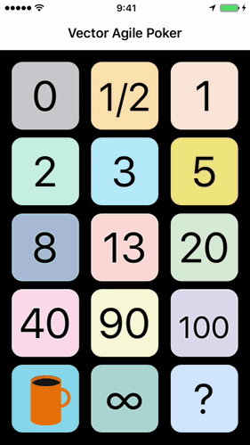

# Vector Agile Poker

## General data (válido para iOS y Android)

[Link to App Store](https://itunes.apple.com/us/app/vector-agile-poker/id1234957805?mt=8)

[Link to Android Project]()

### Version control - iOS

_1.0.0 Version_

* Rediseño de aplicación en Swift 3.
* Animaciones de cartas.

_1.0.1 Version_

* Rediseño de iconos
* Añadido SwiftLint

## Authors

Vector Mobile, hello.mobile@vectoritcgroup.com

## License

VMSlideMenu is available under the MIT license. See the [LICENSE](https://gitlab.vectoritcgroup.com/ios-modules/VectorAgilePoker-iOS/blob/master/LICENSE) file for more info.

## Further Information
For more information on the project, please write to [vectormobility@gmail.com](mailto://vectormobility@gmail.com).